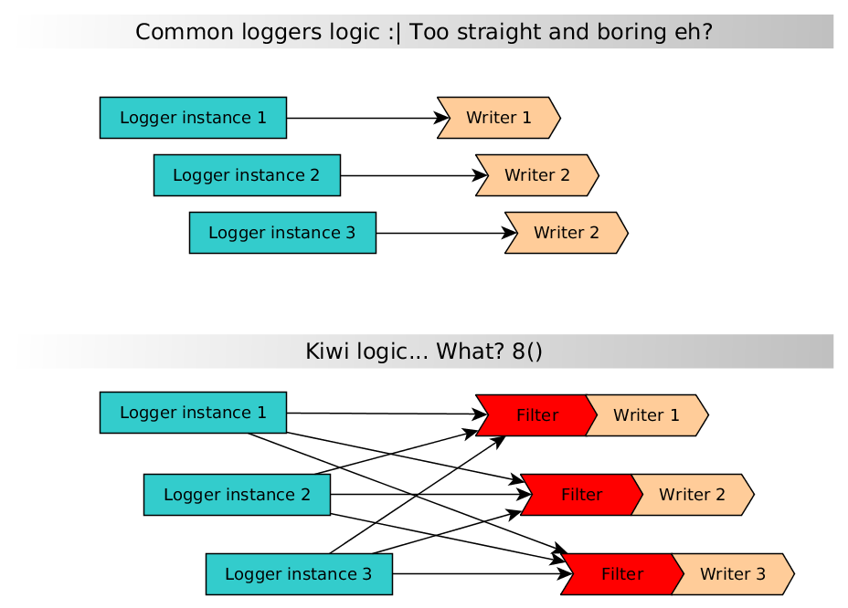
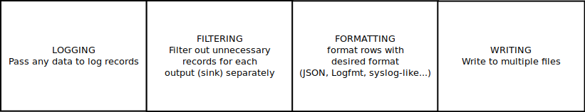

<!--*- mode:markdown;fill-column:100 -*-->
# Kiwi logger & context keeper [](https://goreportcard.com/report/grafov/kiwi) [](https://coveralls.io/github/grafov/kiwi?branch=master)

*Beta version. API still is subject of changes. Use it carefully!*


*Kiwi* /kiːwiː/ are birds native to New Zealand, in the genus Apteryx and family Apterygidae. They
are flightless, have hair-like feathers and smell like mushrooms. They look strange and funny so
when I wrote a logger for Go language I decided to devote it to this beast which I never seen in a
wild (I live very far from places where kiwis are live).

*Kiwi Logger* — this is a library with an odd logic that log your application data in its own strange way.

Well... `kiwi` package is structured logger for key-value formats (with *logfmt* as default), it
highly customizable without hardcoded levels or nailed fields. It has dynamic filters that allow you
change you logs on the fly in two aspects: reduce number of records and restrict fields for each
record. It allows fine control on that should be logged in the moment and especially useful for
debugging. So `kiwi` separates output logic (when and where you want write) from logging process
itself (just log anything what you want).

## Features offered by structered logging and logfmt generally and by Kiwi particularly

* simple format with explicit key for each log message (*logfmt* like) for high readability by humans
* optional JSON format that liked by machines
* has no nailed levels, no hardcoded fields
* dynamic filtering of the output (change log verbosity and set of record fields on the fly)
* can keep context of the application
* has fast forking of subloggers with inherited context
* optional lazy evaluation of arguments for lowering logger footprint
* it fast enough and careful about memory allocs (indeed it faster than popular logrus and log15)

Kiwi logger has built around the idea:

*Log everything in the code with as much details as possible. But actually write only that you need in the moment.*

In the ideal world of course you could log everything and in the central storage view and filter the
records you are interested in the moment. But in reality the most of the systems developed locally
and often you have no central log storage in development environment. And on the production the
records reach the central storage with some annoying delays. So you are just use local console
output for the logging.

For example you are in debugging of the `feature1` that spread across several modules of your
system. You are instrumenting the code with multiple `log()` calls and set verbosity level to
`DEBUG`. Then you have done with the feature and decrease you level to `ERROR`. Then you are begin
to debug `feature2` that spread even more across the modules of your system. And all repeat
again. You are set the level to `DEBUG` and you are see the records both for the `feature2` you are
need and for `feature1` from the past. Welcome to grepping.

The "logfmt" format solves this problem with tags. The log records consists of arbitrary number of
key-value pairs. You can easily filter the only records you are need by the keys. The kiwi logger
allows you set filters dynamically in runtime.

## Architecture?



Scared? ;) Ha-ha... Well, really is not too weird as this picture looks :) Let me explain with more
clear and boring illustrations.



The logger instances (in different goroutines for example) write everything what you want to
log. _Sinks_ gather the data from all the instances. _Sink_ is the name for the output — it could be
file or stdout or any other thing that realizes `io.Writer()`.  Filters for the sinks have rules to
pass only records you are really wants for this output. For example you can dedicate the file for
errors come from `module1` and another file for errors and warnings that come from `module2`.

For example you can pass details of the record to a logfile for full debug.  But write only
important information with an error message and status to stderr.

Recipe: export the handler or setup any kind of client for setting these filters in your app.  Then
you get ability for dynamically change the flow and the verbosity of logs.  For example increase
verbosity for a specific module or a single handler and decrease them for the rest of the
application.

## Docs [](https://godoc.org/github.com/grafov/kiwi)

See documentation in [the wiki](https://github.com/grafov/kiwi/wiki).  Examples of logger usage see
at [cmd/*](cmd) subfolders.  And of course for API description look at
[godoc](http://godoc.org/github.com/grafov/kiwi).

## Installation [](https://travis-ci.org/grafov/kiwi)

Package have not external dependencies except standard library. So just

    go get github.com/grafov/kiwi
	
The library builds has been tested with go 1.8.

## Usage examples

```go
import "github.com/grafov/kiwi"

func main() {
	// Creates a new logger instance.
	log:=kiwi.New()

	// Now just log something as key/value pair. It will pass to output immediately (read about outputs below).
	log.Log("msg", "something", "another key", "another value")
	// Expected output:
	// msg="something" another\ key="another value"

	// You can pass odd number of parameters. Odd parameter passed to output just as is.
	log.Log("key-only")
	// Expected output:
	// "key-only"

	// It can add key=value pairs to a new log record.
	// They don't passed to the output until Log() call.
	log.Add("where", "module1", "event", "something happened")

	// So it may be any number of Add() calls with additional pairs.
	// Then flush them all.
	log.Add("event", "and now something completely different").Log()

	// You can pass any scalar types from Go standard library as record keys and values
	// they will be converted to their string representation.
	log.Log("key", 123, "key2", 1.23e3, "key3", 'u', "key4", true)
	// Expected output:
	// key=123 key2=1.23e3 key3="u" key4=true
	
	// You need define even one sink: set writer and logging format.
	// Until the sink defined log records just saved nowhere.
	// You can define arbitrary number of sinks. Each sink has its own set of filters.
	out:=kiwi.SinkTo(os.StdOut, kiwi.Logfmt).Start()

	// Filters decide pass or not incoming log record to this output.	
	// Example filters below will pass only records which has key "userID" and has value of level="FATAL".	
	out.WithKey("userID").WithValue("level", "FATAL")
	
	// So in this manner you can fan out log record to several outputs.
	// For example write separate log of critical errors and common log with all errors.
	// By default without any filters any output accepts any incoming log records.
	out2 := kiwi.SinkTo(os.StdErr, kiwi.JSON).Start()

	// Kiwi offers various filters for set conditions for outputs.
	out2.WithInt64Range("userID", 100, 500).WithoutValue("label", "debug")
}
```

See more ready to run samples in `cmd` subdirs. Filters described in the wiki:
[Filtering](https://github.com/grafov/kiwi/wiki/Filtering).

## The context records

`Kiwi` logger allows you keep some pairs during lifetime of a logger instance.

```go
import "github.com/grafov/kiwi"

func main() {
	// Creates a new logger instance.
	log1 := kiwi.New()

	// You can set permanent pairs as logger context.
	log1.With("userID", 1000, "PID", os.GetPID())

	// They will be passed implicitly amongst other pairs for the each record.
	log1.Log("msg", "details about something")
	// Expect output:
	// userID=1000 PID=12345 msg="details about something"
	
	// Context copied into a new logger instance after logger cloned.
	log2 := log1.New()
	
	log2.Log("key", "value")
	// Expect output:
	// userID=1000 PID=12345 key="value"
	
	// Get previously keeped context values. Results returned as map[string]interface{}
	appContext := log2.GetContext()
	fmt.Printf("%+v\n", appContext)
	
	// You can reset context at any time with
	log2.ResetContext()
}
```

## Thread safety

It is unsafe by design. Firstly I have used version for safe work in multiple goroutines.  And it
was not only slow but in just not need in many cases.  If you need a new logger in another execution
thread you will create another instanse. Better is clone old instance to a new one for passing the
context to a subroutine. It is all.

```go
	// Creates a new logger instance.
	log1 := kiwi.New().With("context key", "context value")

	// Just clone old instance to a new one. It will keep the context of the first instance.
	log2 := log1.New()
	
	// And you can extend context for cloned instance.
	log2.With("another key", "another value")

	// So other concurrent routines may accept logger with the same context.
	go subroutine(log2, otherArgs...)
```

For the small apps where you won't init all these instances you would like use global `kiwi.Log()` method.
This method just immediately flush it's args to the sinks. And by design it is safe for concurrent usage.
Also due design simplicity it not supports context, only regular values. If you need context then you 
application is complex thing hence you will need initialize a new instance of kiwi.Logger().

## Evaluating rules

* Keys and values evaluated *immediately* after they added to a record.
* Context values evaluated *once* when they added to a logger.
* For lazy evaluating of context and record values pass them as functions:

```go
    # For lazy evaluating you need function that returns string
    func longActionForDelayedEvaluation() string {
        // Do something complex...
        // and got for example integer result.
		//
		// You need convert the result to a string.
        return strconv.Itoa(result)
    }
    myLog.Add("lazy-sample", longActionForDelayedEvaluation) # but not longActionForDelayedEvaluation()
```

Logger accepts functions without args that returns a string: `func () string`.
Hence value of `lazy-sample` from the example above will be evaluated only on `Log()` call.

## Warning about evil severity levels

The most of loggers came to you with concept of `levels`. So you are filter anything but only
records of the preconigured level and levels above really appear in the log. The current level read
from the configuration of the application. There are loggers that allow you change the level in
runtime. The level here is like the key in logfmt. But logfmt became with more general idea: you can
arbitrary number of keys for the filtering. Not only predefined words for levels but any things like
`feature`, `module` etc. So you can filter not only by the severity but set general taxonomy of the
categories across all the parts (subsystems, modules) of your application.

Another problem with traditional syslog-like levels is non clear specification what exactly should
pass to each level. Look up the internet for many guides with controversial recommendations how to
distinguish all these "standard" levels and try map them to various events in your application. So
in the reality programmers often debate about level for the log record. For example when you should
use "fatal" instead of "critical" or use "debug" instead of "info". So very often severity levels
obstruct understanding of the logs.

You can use log syslog-like levels in `kiwi` if you are comfortable with them (see helper functions
in `level` subpackage) and interprete them as you wish.  Severity levels in `kiwi` don't play any
role in deciding how to output the record.  Any records with any level will pass to all sinks.
Filters in each sink will decide how to actually display the record or filter it out completely.

## Instead of FAQ

0. Kiwi logger not strictly follows logfmt specs.
1. Ideas of key-value format are like JSON format but with orientation on readability for humans first.
2. Yes, it was architectured and developed to be a standard number 15 that competing with others. It is not pretend to be log format for everything.
3. No, it is not related to `log15` logger though `kiwi` shares the same logfmt format and some ideas with him.
4. It did not offer "Logger" interface because IMO interface is useless for loggers. It offers interfaces for the parts of logger like formatters.

## Similar works for structured logging

* [logxi](https://github.com/mgutz/logxi)
* [logrus](https://github.com/Sirupsen/logrus)
* [log15](https://github.com/inconshreveable/log15)
* [zlog](https://github.com/HardySimpson/zlog) - this one is even not in Go but this C logger has some similar ideas.

## Comparison with other loggers

It is not the fastest logger among benchmarked but fast enough and careful about memory allocations.
It much faster than `logrus` and `log15`. But slower than `logxi` tests. Need more detailed tests
though.  See the benchmarks results at
[github.com/grafov/go-loggers-comparison](https://github.com/grafov/go-loggers-comparison).

## Roadmap

What should be done before the first release:

* test behaviour of all the filters and fix possible bugs
* test JSON output and fix possible bugs
* ~~realize API for custom filters~~

Future plans:

* ~~extend the predefined filters~~ (cancelled)
* optional colour formatter for the console
* throttling mode for sinks
* ~~increase tests coverage up to 50%~~
* add tests for concurrent execution use cases
* increase tests coverage up to 75%

See details about tasks and ideas in `TODO.org` (orgmode format).
See current [tests coverage](http://gocover.io/github.com/grafov/kiwi).

## Origins

* logfmt description [brandur.org/logfmt](https://brandur.org/logfmt)
* logfmt realization in Go and specs [godoc.org/github.com/kr/logfmt](https://godoc.org/github.com/kr/logfmt)
* see also logfmt realization [github.com/go-logfmt/logfmt](https://github.com/go-logfmt/logfmt)
* picture used for logo [openclipart.org/detail/4416/kiwi-bird](https://openclipart.org/detail/4416/kiwi-bird)

